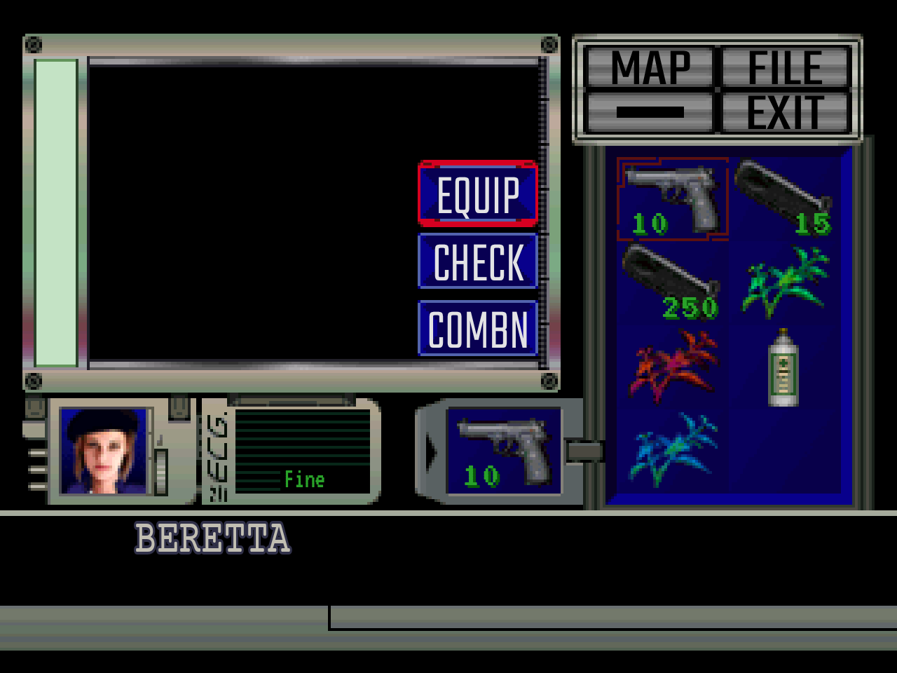

# Resident Evil 1 Inventory (1996)

A recreation of the inventory screen from the original Resident Evil (1996),
built with Vue, TypeScript, Pinia and Vite. The 320 × 240 screen is drawn from
pixel-art images and scaled by whole screen pixels, so it stays sharp.



## What works

- **Inventory:** Jill's eight slots, item amounts, the item name under the cursor.
- **Action menu:** EQUIP or USE, CHECK and COMBN for the selected item.
- **EQUIP** a weapon; the equipped weapon panel shows it.
- **USE** a recovery item; the ECG shows the new health status.
- **CHECK** an item: its 3D model (Three.js) tumbles in and can be turned, and
  S types its description.
- **COMBN** two items: reload a weapon, stack ammunition, or mix herbs after
  "Will you mix the herbs?".
- **Descriptions** type out and wait for S or A, as in the game.
- **MAP** opens the Mansion's map: ↑ and ↓ pick 1F or 2F over the aerial view,
  S opens that floor's map, and A steps back.

[UI_FEATURES.md](UI_FEATURES.md) lists every feature and its status, and
[INVENTORY_ACTIONS.md](INVENTORY_ACTIONS.md) the game rules behind each action.

## Controls

The inventory uses only the keyboard; the mouse does nothing.

| Key     | What it does                                                                                      |
| ------- | ------------------------------------------------------------------------------------------------- |
| ↑ ↓ ← → | Moves the cursor of the part that has input (grid, top menu, action menu, Yes/No); stops at edges |
| S       | Chooses; hurries typing text; closes a complete description                                       |
| A       | Steps back once                                                                                   |
| D       | Shows the next health status (a demo control)                                                     |
| ↑ ↓ ← → | CHECK: turns the model                                                                            |
| Z / C   | CHECK: rolls the model clockwise and counter-clockwise                                            |
| X / V   | CHECK: zooms in and out                                                                           |
| ↑ ↓     | MAP: picks the floor                                                                              |

## Development

```sh
npm install
npm run dev
```

| Command                | What it does                                                   |
| ---------------------- | -------------------------------------------------------------- |
| `npm run dev`          | Starts the Vite dev server                                     |
| `npm run build`        | Type-checks with `vue-tsc`, then builds the bundle in `dist/`  |
| `npm run preview`      | Serves the built bundle                                        |
| `npm test`             | Runs the Vitest unit tests                                     |
| `npm run test:e2e`     | Runs the Playwright end-to-end tests in Chromium               |
| `npm run test:e2e:ui`  | Opens Playwright's UI mode                                     |
| `npm run format`       | Formats the code with Prettier (`format:check` only reports)   |

The end-to-end tests start their own dev server on port 5174 and render
WebGL in software, so they need no GPU. On WSL, if the UI mode opens no window,
run `npm run test:e2e:ui -- --ui-port=8080` and open the printed address.

## Docker

From this directory, build and start the production app:

```sh
docker compose up --build -d --wait
```

Open http://localhost:8080/re1-1996-inventory/.

The image builds with Node and serves the generated static files with Nginx.
Compose inherits the image's healthcheck, which requests `/re1-1996-inventory/`
every 30 seconds and marks the container unhealthy after three consecutive
failures. The startup grace period is five seconds, and each check has a
three-second timeout.
Docker does not automatically restart a container solely because it is unhealthy.

```sh
docker compose ps
docker compose logs -f web
docker compose down
```

Rebuild after source changes; this setup serves a production build without hot reload.

## Structure

```text
design/                 Reference screenshots, sprite sheets and recordings
docs/
  glossary.md           The words the code uses for each part of the UI
  data-model/           Data model diagram and open questions
e2e/                    Playwright tests, a page object and fixtures
public/models/          CHECK's 3D model (one placeholder for every item)
scripts/                extract-item-sprites.py: cuts item images from the sheet
                        build-fonts.py: builds the re1-text and re1-digits
                        colour fonts from the font and UI sprite sheets
                        extract-map-sprites.py: cuts the map's sprites from
                        the map sheet
src/
  App.vue               Layout of the screen; connects the stores to the panels
  main.ts               Vue entry point; imports shared CSS once
  components/           One component per panel; they get props and emit presentation events
  input/                Keyboard: arrows, S, A and D as intents
  elements/             State of each interactive part: cursors, action menu,
                        prompt, description
  actions/              EQUIP, USE and COMBN; each returns an outcome
  stores/
    inventory.ts        The screen's modes; routes every intent by mode
    player.ts           The player's data and the game rules that change it
  services/             Read the static data
  mappers/              Turn JSON records into typed data and item views
  data/                 Static game data (items, recipes, characters) as JSON
  types/                Types and constants
  assets/               Characters, fonts, items and panel artwork
  styles/               tokens.css, reset.css, base.css, fonts.css
UI_FEATURES.md          What the UI does today and what is planned
INVENTORY_ACTIONS.md    What the reference recordings show about each action
```

Unit tests live in a `__tests__` folder next to the code they test.

## Conventions

- **Words:** [docs/glossary.md](docs/glossary.md) names every part of the UI
  and says where to find it in the code. Use its words.
- **Code:** semicolons (Prettier enforces them); docblocks (`/** … */`) instead
  of `//` comments; constants instead of magic strings; lookup tables instead of
  long `switch` statements.
- **CSS:** shared values live in `tokens.css`, such as `--game-pixel` (one pixel
  of the game's screen). Each component keeps its layout in `<style scoped>`
  and uses BEM classes (`block`, `block__element`, `block__element--modifier`).
- **Assets:** imported images and fonts go under `src/assets/`; files that need
  a fixed public URL go under `public/`.

## Reference

[Game UI Database](https://www.gameuidatabase.com/gameData.php?id=2179)

## Credits

- Item and UI sprites ripped by Badassbill, from
  [The Spriters Resource](https://www.spriters-resource.com/playstation/residentevildirectorscut/).
- Map sprites (aerial view, floor maps, floor arrows) ripped by Badassbill from
  Resident Evil DX; `scripts/extract-map-sprites.py` cuts them from the sheet.
- Fonts, hosted locally with their SIL Open Font Licenses in `src/assets/fonts/`:
  - [Teko](https://fonts.google.com/specimen/Teko): the top menu and the action menu.
  - [VT323](https://fonts.google.com/specimen/VT323): the ECG label.
- `re1-text` and `re1-digits` (`src/assets/fonts/`) are built by
  `scripts/build-fonts.py` from Badassbill's font and UI sprite rips.
